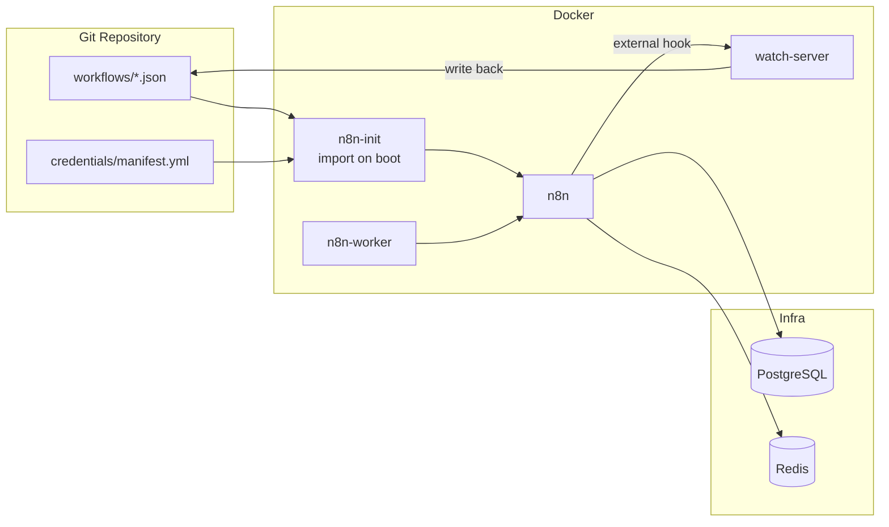

# n8n-starter

GitOps for n8n. Version your workflows. Let AI agents create and manage automations.

[](https://github.com/gabry-ts/n8n-starter/actions/workflows/ci.yml)
[](./LICENSE)
[](https://docs.docker.com/)
[](https://github.com/gabry-ts/n8n-starter)


## Why

n8n has no native workflow versioning. If your instance dies, your workflows die with it.

**n8n-starter** uses Git as source of truth — every workflow and credential is a file you can version, review, and restore. Two-way sync keeps your repo and n8n instance in lockstep.

## How It Works



1. **Boot** — `n8n-init` reads workflow JSON files and `credentials/manifest.yml` from the repo and imports them into n8n
2. **Runtime** — every save in the n8n UI triggers an external hook that sends the workflow to `watch-server`, which writes it back to disk
3. **Loop closes** — commit and push, your Git repo is always up to date

## AI Agent Integration

Any AI agent (Claude Code, GPT, Copilot, custom scripts) can create n8n workflows by writing a JSON file to `workflows/` and committing. On next deploy, the init container picks it up automatically.

```
# Write a file → commit → deploy → done
echo '{ ... }' > workflows/my-automation.json
git add . && git commit -m "feat: add my automation"
docker compose up -d
```

- **Write a file** — drop a valid n8n workflow JSON into `workflows/` (subdirectories become n8n folders)
- **Commit and deploy** — `docker compose up -d` imports everything
- **Branch = environment** — `main` goes to production, feature branches to staging

The `.claude/skills/n8n-skills/` directory contains the [n8n-skills](https://github.com/haunchen/n8n-skills) knowledge base (v2.2.0), giving Claude full awareness of 545 n8n nodes and workflow patterns. Update it with `yarn skills:update`.

See `CLAUDE.md` for detailed instructions on how AI agents should interact with this project.

## Quick Start

```bash
cp .env.example .env
docker compose up -d
open http://localhost:12001
```

Default login: `admin@admin.local` / `password`

## Services

| Service | Port | Description |
|---------|------|-------------|
| n8n | 12001 | n8n UI + API |
| n8n-worker | - | Queue-based workflow executor (scalable) |
| postgres | 12000 | Shared database |
| redis | - | Job queue (Bull) |
| watch-server | 3456 | Auto-export webhook receiver |

## Scaling Workers

```bash
docker compose up -d --scale n8n-worker=5
```

## Credentials

Credentials are defined in `packages/n8n/credentials/manifest.yml`. Two formats:

**Manual** — explicit env var mapping:

```yaml
credentials:
  - name: "My API"
    type: "httpHeaderAuth"
    env_mapping:
      name: "MY_HEADER_NAME"
      value: "MY_HEADER_VALUE"
```

**Auto-generated** — when you create a credential in the n8n UI, the watch-server fetches its schema and writes an `_autoCredentials` entry with `${ENV_VAR}` placeholders. Fill in the env vars in `.env` and they get bootstrapped on next startup.

Actual secret values live in `.env`, never in the manifest.

## Production Mode

```bash
docker compose -f docker-compose.prd.yml up -d
```

Differences from dev:

- No watch-server (import-only, no auto-export)
- Credentials mounted read-only
- Standard Docker volumes instead of local bind mounts

## Adding Packages

To add a new package (e.g., a backend service):

1. Create `packages/backend/docker-compose.yml`
2. Include it from the root:

```yaml
include:
  - packages/n8n/docker-compose.yml
  - packages/backend/docker-compose.yml
```

## Environment Variables

All env vars in `.env` are available to n8n services via `env_file`. See `.env.example` for available options.

## Contributing

Issues and PRs welcome. See `CLAUDE.md` for project conventions and context.

## License

[MIT](./LICENSE)
